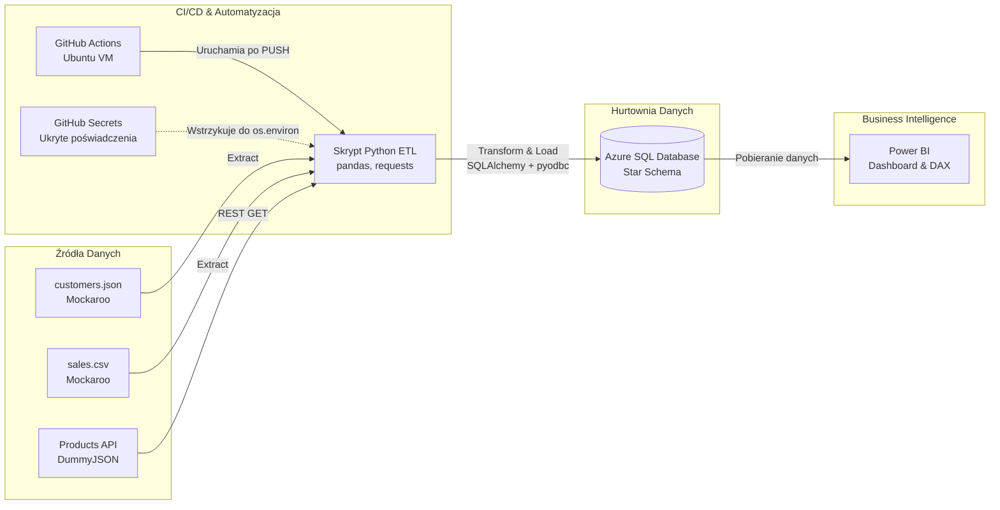
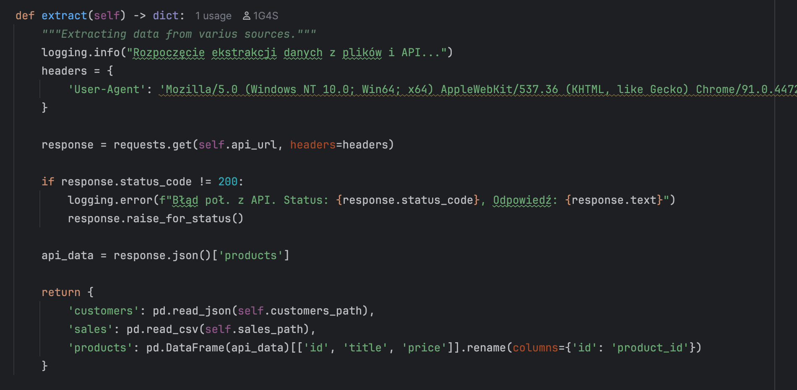
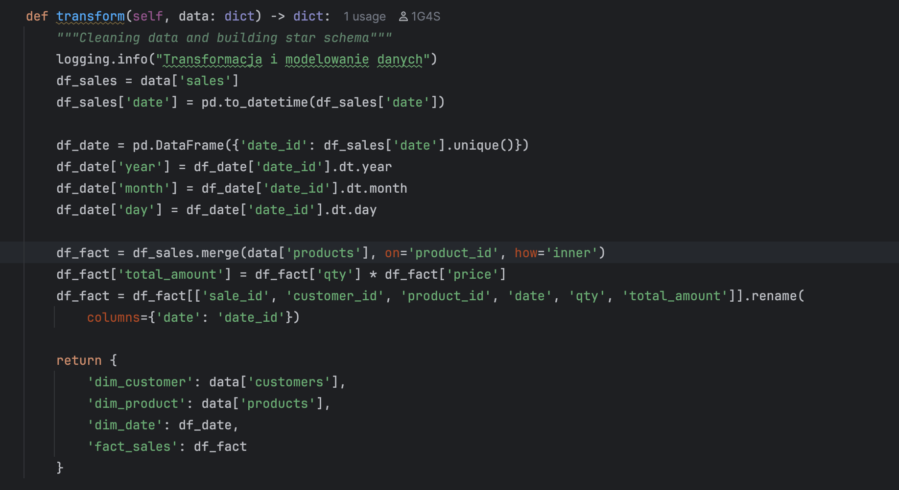
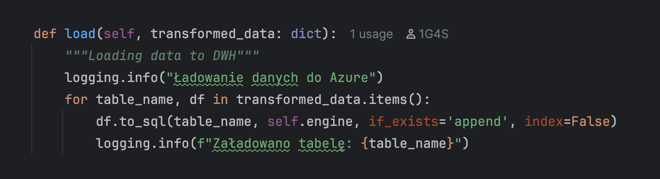
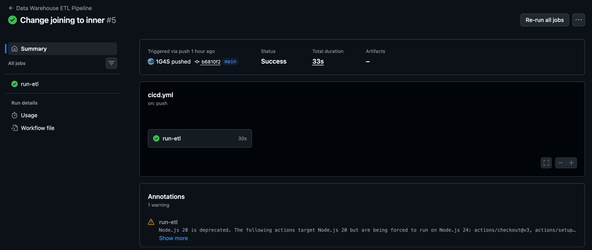
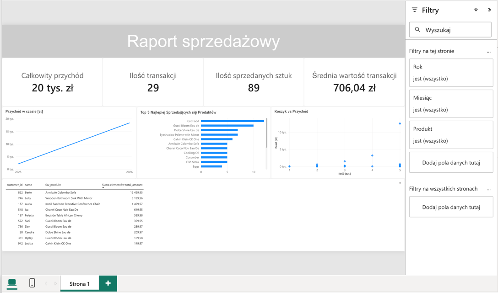

# End-to-End Sales Data Warehouse & CI/CD Pipeline

### Wstęp: Cel i zakres projektu
Celem niniejszego projektu było zaprojektowanie i wdrożenie nowoczesnej chmurowej hurtowni danych dla przedsiębiorstwa z sektora e-commerce. Głównym wyzwaniem była integracja rozproszonych i nieustrukturyzowanych źródeł danych (pliki płaskie oraz interfejsy API) w spójne i wiarygodne źródło prawdy (Single Source of Truth), umożliwiające zaawansowaną analitykę biznesową. Projekt koncentrował się na budowie zautomatyzowanego rurociągu przetwarzania danych (ETL) w języku Python, wdrożeniu schematu gwiazdy (Star Schema) w środowisku **Azure SQL Database** oraz pełnej automatyzacji procesu wdrażania i testowania za pomocą **GitHub Actions** (CI/CD). 

---

### Stos Technologiczny (Tech Stack)
*   **Język programowania:** Python 3.10 (OOP, `pandas`, `requests`, `sqlalchemy`, `pyodbc`)
*   **Baza danych:** Microsoft Azure SQL Database (DTU-based)
*   **Orkiestracja i CI/CD:** GitHub Actions (Ubuntu-latest)
*   **Wizualizacja (BI):** Microsoft Power BI
*   **Bezpieczeństwo:** GitHub Secrets (szyfrowanie zmiennych środowiskowych)

---

### Opis techniczny zrealizowanych etapów przetwarzania danych (ETL)
Proces transformacji zrealizowano z wykorzystaniem paradygmatu programowania obiektowego (OOP) w Pythonie, dzieląc prace na trzy kluczowe etapy (Extract, Transform, Load), z których każdy pełnił specyficzną rolę w łańcuchu uszlachetniania danych.

#### 1. Warstwa Ekstrakcji (Extract)
Warstwa ta została zaprojektowana jako punkt wejścia dla danych pochodzących z trzech niezależnych, heterogenicznych źródeł. Głównym celem było bezpieczne pobranie danych przy ścisłym zachowaniu ich pierwotnej struktury.
*   **Zróżnicowane formaty:** Wczytano dane o klientach z pliku `customers.json` oraz dane transakcyjne z pliku `sales.csv`.
*   **Integracja z API:** Zintegrowano proces z zewnętrznym interfejsem REST API (`DummyJSON`) w celu pobrania aktualnego katalogu produktów. Wdrożono autoryzację nagłówków (User-Agent) oraz walidację kodów odpowiedzi HTTP (Status 200).

#### 2. Warstwa Transformacji (Transform) i Implementacja Modelu Gwiazdy
W tej warstwie przeprowadzono czyszczenie i logiczną transformację danych surowych w ustrukturyzowane tabele analityczne. Dokonano dekompozycji danych na tabele wymiarów (Dimension Tables) oraz tabelę faktów (Fact Table) zgodnie ze standardami hurtowni danych.
*   **Ekstrakcja wymiaru czasu:** Wygenerowano niezależną tabelę `dim_date`, wyodrębniając z surowej daty transakcji atrybuty takie jak rok, miesiąc i dzień, co umożliwia późniejszą analizę szeregów czasowych.
*   **Inżynieria cech (Feature Engineering):** W tabeli faktów zaimplementowano logikę biznesową wyliczającą całkowitą wartość transakcji (`total_amount = qty * price`).
*   **Zapewnienie integralności (Data Integrity):** Zastosowano złączenia typu `INNER JOIN` podczas budowy tabeli `fact_sales`, co wyeliminowało ryzyko załadowania transakcji dla produktów nieistniejących w zaktualizowanym katalogu API, zapobiegając błędom klucza obcego (Foreign Key Constraints) w bazie docelowej.

#### 3. Warstwa Ładowania (Load)
Finalny etap obejmował masowy zapis wymodelowanych struktur bezpośrednio do chmury obliczeniowej.
*   **Infrastruktura docelowa:** Dane zostały zapisane w instancji Microsoft Azure SQL Database za pomocą silnika `SQLAlchemy` oraz sterowników `ODBC Driver 18`.

---

### Automatyzacja procesu i CI/CD (GitHub Actions)
Kluczowym elementem projektu, odróżniającym go od tradycyjnych, lokalnych skryptów, jest pełna automatyzacja uruchamiania procesu ETL w oparciu o praktyki Continuous Integration / Continuous Deployment.
*   **Konfiguracja Workflow:** Utworzono plik konfiguracyjny `.github/workflows/cicd.yml`, który automatycznie inicjuje proces przetwarzania danych po każdym zdarzeniu typu `push` na głównej gałęzi repozytorium.
*   **Izolacja środowiska:** Kod uruchamiany jest na dedykowanej maszynie wirtualnej Ubuntu-latest. Proces obejmuje bezobsługową instalację sterowników bazy danych oraz pakietów Pythona.
*   **Bezpieczeństwo danych uwierzytelniających:** Zastosowano zaawansowany mechanizm **GitHub Secrets**. Parametry połączeniowe do bazy danych (nazwa serwera, użytkownik, hasło) są szyfrowane i wstrzykiwane jako zmienne środowiskowe (`os.environ`) w czasie rzeczywistym, co całkowicie eliminuje ryzyko wycieku poświadczeń w kodzie źródłowym.

---

### Projektowanie i implementacja warstwy wizualizacji (Power BI Dashboards)
Po przygotowaniu warstwy analitycznej w Azure SQL, przystąpiono do budowy interaktywnego dashboardu biznesowego w narzędziu **Power BI**. Proces ten miał na celu udostępnienie wskaźników biznesowych (KPI) użytkownikom końcowym.
*   **Optymalizacja wydajności:** Wykorzystano zaimplementowany wcześniej relacyjny schemat gwiazdy (1:N), co wyeliminowało potrzebę tworzenia kosztownych i skomplikowanych złączeń bezpośrednio na poziomie narzędzia wizualizacyjnego.
*   **Zaawansowane miary DAX:** Zaimplementowano dedykowaną miarę analityczną wykorzystującą funkcję `TOPN` i `CALCULATE` do dynamicznej identyfikacji "Ulubionego Produktu" dla każdego klienta, bez ryzyka duplikacji wierszy w tabelach wielowymiarowych.
*   **Interaktywność i design:** Raport zawiera zbiór filtrów czasowych i produktowych, karty głównych wskaźników (Suma Przychodu, Ilość Transakcji) oraz wykresy obrazujące historyczne trendy sprzedaży i udziały poszczególnych klientów w obrotach firmy.

---

### Podsumowanie: Osiągnięte korzyści i wnioski
Realizacja projektu w opisanej architekturze pozwoliła na osiągnięcie wymiernych korzyści technologicznych:
*   **Bezobsługowość (Automation):** Dzięki zastosowaniu GitHub Actions, system jest w pełni zautomatyzowany i aktualizuje hurtownię danych przy każdej rewizji kodu.
*   **Skalowalność i wydajność:** Oparcie architektury o chmurę Azure SQL oraz paradygmat Star Schema sprawia, że system jest gotowy na przyjęcie wielokrotnie większego wolumenu danych bez zauważalnego spadku wydajności raportowania.
*   **Bezpieczeństwo:** Pomyślne zastosowanie GitHub Secrets gwarantuje zgodność z najlepszymi praktykami SecOps w inżynierii danych.

Wnioski z projektu wskazują, że odpowiednia dekompozycja zadań (OOP), separacja poświadczeń od kodu oraz oparcie modelu analitycznego o schemat gwiazdy to kluczowe fundamenty budowy niezawodnych systemów klasy Data Warehouse.